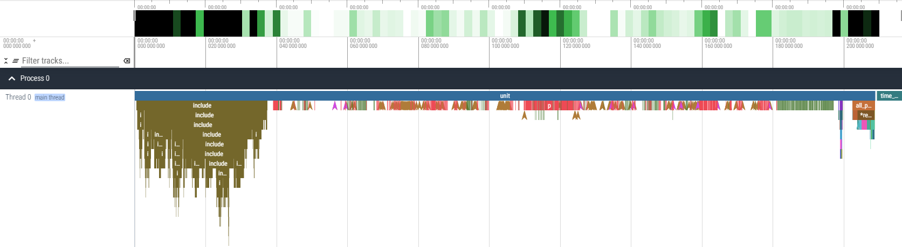

# gcc-time-trace-plugin

This is a plugin for GCC that collects internal GCC events and generates a trace file, which can be visualized with [Perfetto UI](https://ui.perfetto.dev).

## Requirements

- GCC 6.5 or later

This plugin may work with older versions of GCC that support plugins, but I did not test on them.

## How to build

### Prerequisites

#### Tools

Install tools below to build this plugin.

- GNU Make or Ninja
- CMake version 3.0 or later

This plugin may be built with older versions of CMake, but I did not built with them.

#### Files for GCC plugin development

This plugin depends on headers for plugins provided by GCC.

If you are using Ubuntu and installed GCC with APT, you can install plugin headers with the command below. Replace `<major version>` with your GCC's major version.

```sh
sudo apt install gcc-<major version>-plugin-dev
```

##### Other systems

I have not tested on other systems, but plugin headers may be installed by default in some cases. If an `include` directory exists within the directory output by `g++ -print-file-name=plugin`, then they are already installed. If the previous command only outputs `plugin`, they are not installed.

If the headers are not installed, you may still install them with your system package manager.

### Building

Note that the built binary includes code derived from GCC's plugin headers, so if you redistribute that binary, it must be licensed under GPLv3.

First, download this repo.

```sh
git clone https://github.com/shouth/gcc-time-trace-plugin.git --depth 1
cd gcc-time-trace-plugin
```

There are two methods for building, depending on the compiler you are using.

- Same compiler used for building and running the plugin
- Different compiler used for building and running the plugin

#### Same compiler used for building and running the plugin

This is the standard method. Run the commands below.

```sh
cmake -B build -S .
cmake --build build
```

After building, you will find the built plugin at `./build/timetrace.so`.

#### Different compiler used for building and running the plugin

This method can be used when building the plugin for a cross-compiler or similar cases.
Run the commands below. Do not forget to replace `<path-to-target-gcc>` with appropriate one.

```sh
cmake -B build -S . -D TIME_TRACE_PLUGIN_TARGET_GCC=<path-to-target-gcc>
cmake --build build
```

After building, you will find the built plugin at `./build/timetrace.so`.

## How to use

Add `-fplugin=<path to timetrace.so>` to your build command. This plugin generates trace files in the [Trace Event Format](https://docs.google.com/document/d/1CvAClvFfyA5R-PhYUmn5OOQtYMH4h6I0nSsKchNAySU/preview?tab=t.0#heading=h.yr4qxyxotyw) in the same directory as each translation unit. Each trace files has an extension `.trace.json`.

Trace files can be visualized with tools that support Trace Event Format, such as [Perfetto UI](https://ui.perfetto.dev) or [chrome://tracing](chrome://tracing).

### Example

After building this plugin by the standard method, you can run the following command to see how it works:

```
g++ -fplugin=./build/timetrace.so example.cpp
```

This will generate a file named `a-example.cpp.trace.json`. You can upload this trace file to [Perfetto UI](https://ui.perfetto.dev) to visualize it.



### Options

#### `-fplugin-arg-timetrace-verbose-decl=<verbosity>`

`<verbosity>` can be 0, 1, or 2. Default value is 1. This option determines the level of detail for function names in the trace file. At level 0, only the name is included; at level 1, the scope name is added; at level 2, argument information is also added. Higher values provide more detail but also increase the size of the trace file.

Specifying an argument of 2 may, in very rare cases, cause a segmentation fault. The cause is unknown, and there is currently no estimate for a fix.

#### `-fplugin-arg-timetrace-disable-version-check`

This option tell this plugin to skip version check and run anyway. If this option is specified, the plugin may not work correctly.
